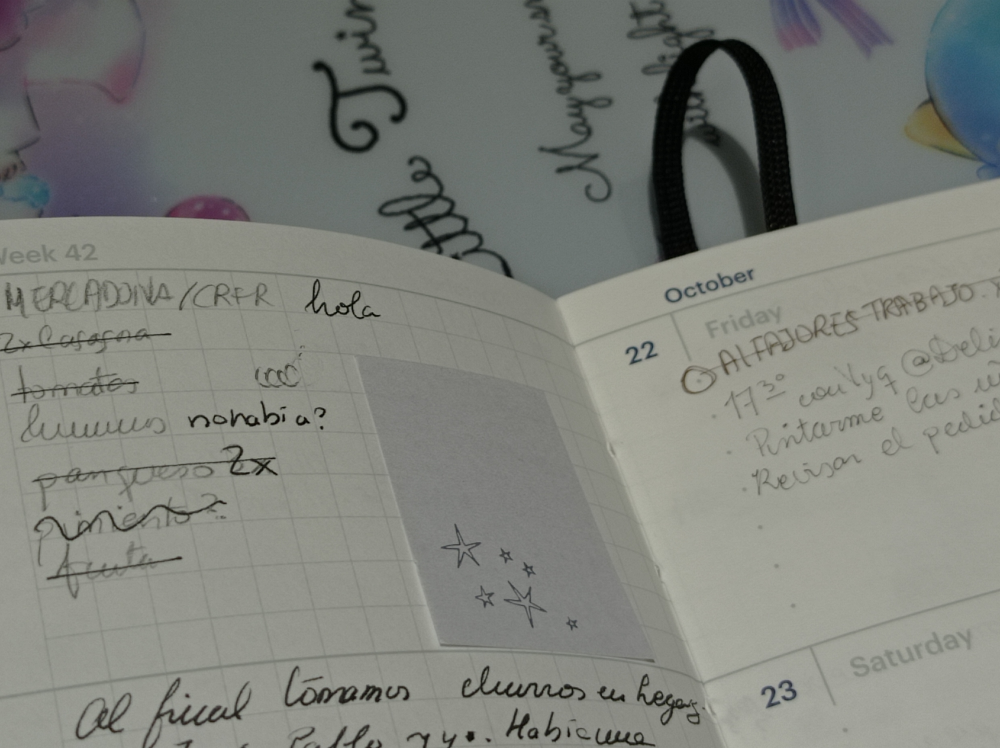
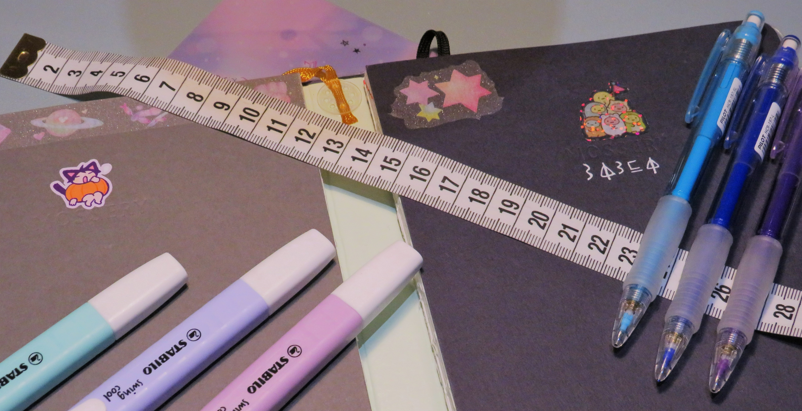
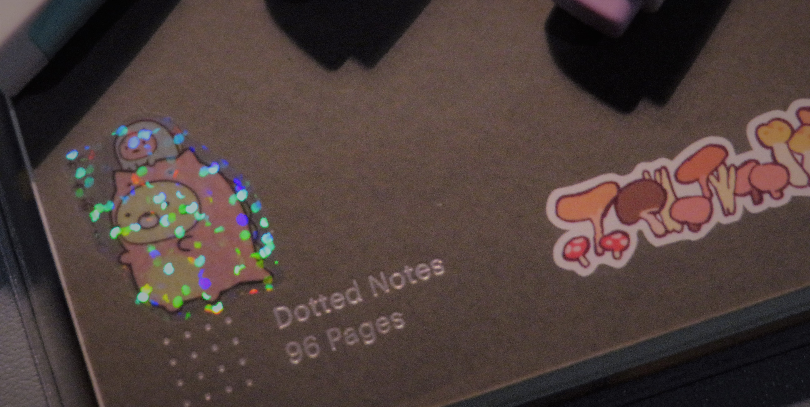
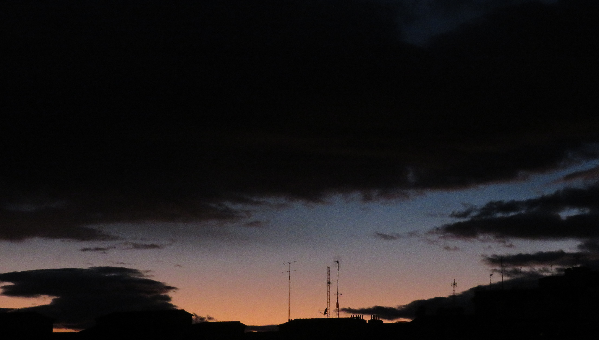

| Written during...          | @                    |
|---------------------------|----------------------|
| Sunday, November 7th      | right after midnight |
| Monday, November 8th      | night                |
| Thursday, November 11th   | night                |
| Monday, November 11th     | night                |

## Some nonsense

 _for starters..._ 

A big portion of my day-to-day consists in **journaling** in small parts.
Or, rather, noting down many of the things I do, I've done, I have to do,...etc.

I find that it's easier-for me, at least- to process everything that happens in a day if I write it down, for some reason.
I guess you could say that I force my brain to recall the events on that day, playing some sort of memory game.

Getting real for a moment: periods of my life during which I _have_ made an effort to write down stuff in a journal, notebook, agenda, etc. are the ones that I remember better. 
Not because I re-read them, which I really don't.
In fact whenever I do a big notebook/papers/stationary cleanout, I tend to read my stuff and just surprise myself with all the things I did, how I felt, make myself think so much about how I've changed.
The latter is actually one of the big reasons I don't clean out my stuff that often...I dread the emotional effort I'm going to put myself through, ironically.

 check out her shop [here](https://www.mecchi.fr/shop)\!_ : photo by me](mecchi-pumpkin_sticker.jpg)

I don't know whether it is the effect or the reason behind it, but _yes_: I am easily pulled by nostalgia.

_ : photo by me](mushrooms.JPG)

About 3 or 4 years ago I decided to 'live more in the present' and not to occupy myself with taking pictures, recording and writing down whatever that was happening just to reminisce on it later instead of experiencing it.
Add some unexpected good, bad and varying feeling-evoking events to life and now I feel like ever since the pandemic (or even before then, to be honest) I can't really tell how much time has passed, how I've changed or what direction I am going in. Of course I can, though, I am aware of myself, it's just... I know myself enough that I feel like I could remember more, at times?

As someone who leans more controlling than most, this does slightly stress me out.
I don't need a plan, _per se_. In fact, I _don't want_ it. But... I guess I want to be able to stop sometimes and look around the path that I'm walking on, instead of mindlessly taking steps that disappear right after I get off from them, like, you know, the ones in platform games when you get through the first levels and the platforms disappear after you step on them for a certain amount of time to throw you some sort of _curve ball_.

Each one of us has different interests, even something as...weird?...as how much we like or hate to do some introspection, how we feel about it, checking in with ourselves about our feelings or even the outright intensity with which we feel our feelings or how we manifest them(lol wtf).

## so...why

_Anyways_, I could get deeper and deeper, but what I'm failing to say here is that I wanna use this as the place where I write down many of the things that I choose to note down.
Be it silly pictures or opinions on movies, tutorials or straight-up notes on Math and/or Computer Science,...
whatever the hell it is I just wanna record it somewhere that pleases the idea on my mind about having a "master book" of sorts where I can access ~~mostly~~ everything I know. 
And if you want to check on it every once in a while, I'm ok with that. And if you don't want to come even close to this link ever again, I'm even more ok with that! 

Personally, my experience growing up with the internet was getting into the type of communities that live on sharing information with everybody, open to feedback, etc. 
The "we can all learn from everybody"-leaning type of mindset.

## what are you trying to do next¿

Honestly, I _don't really know_.

I'm planning on doing a post talking about the categories of posts that I'm still planning, as well, the tags, the stuff I wanna focus on learning and documenting in the near future,...etc.
If for some reason you have any suggestions, don't be afraid to hmu or comment something here? If I fix the disqus plugin that allows comments...?

I'm still extremely unsure on whether to link this blog to my fucking Linkedin page, of all places...I want to be able to show off my recording-stuff skills, though, I guess?

P.D.: are there any less dumb synonyms for "stuff" or am I just annoying myself by repeating the word over and over? Also, thank you for reading until here?? `What`.

As a closing message, please treat others the way you would like to get treated, don't be an asshole to animals, respect people's identities, tip your waiters and public service workers.

I wish you a very nice day, happy times with the people in your life and some healing time if you would like it💕

\- sasha